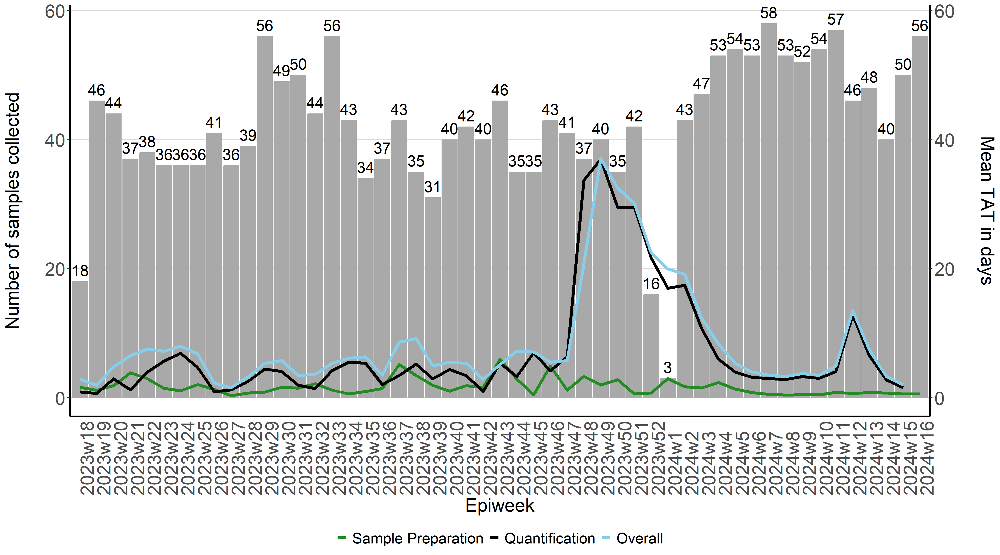
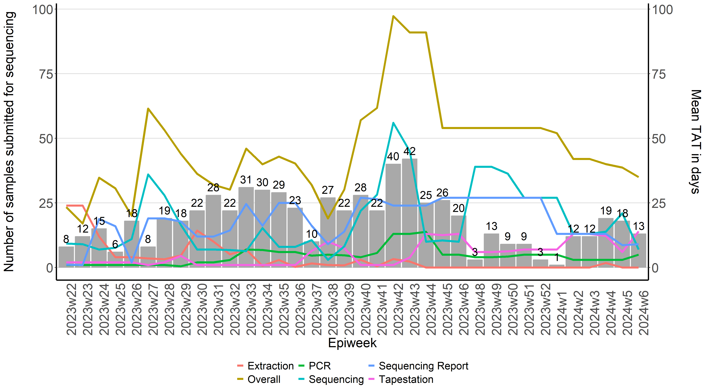

##Laboratory And Sequencing Turnaround Times

Timely reporting of sample test results is required to support the wastewater-based 
surveillance of pathogens. This ensure that any changes in the transmission of pathogens circulating 
within the population or even circulating variants may be detected in a timely manner. 

Laboratory turnaround times (tat) are plotted each week to help rapidly identify delays at various 
points at which samples are processed. This helps us quickly identify what may be causing delays and 
address any challenges which may be faced. 

There are two graphs generated: one for the time taken to produce the quantitative levels of SARS-CoV-2 in wastewater, 
and the other for the time taken to produce the sequencing results for those samples. The graphs produced illustrate the
number of samples collected and processed during each week as a bar graph, and a line graph representing the average turnaround 
time of all samples during a given week. 

#Setting up 

The graphs are produced using R version 4.2.2 or higher and the following packages are required to run the script: 

	library(ggthemes)
	library(scales)
	library(tidyverse)
	library(readxl)
	library(lubridate)
 

RedCap is used by our team as a database to capture and store sample information. There are two ways in which data may be exported for use . The first
is to download a csv file from RedCap. The read.csv() function will be used to import the the csv file into
a dataframe. The types of data within each column may be specified using col_types. The coloumns don't always have to specied,but sometimes dates may be imported as numeric values. So specifying the columns helps prevent that from happening. 

	water <- read.csv("Path/to/the/file.csv", check.names = F) #Replace the path with the path to the file on your computer

Alternatively, the RedCap API token may be used to automatically connect to RedCap within the R script, such that fresh data is taken from RedCap without the need to manually export the data. 
To obtain the API token, log into RedCap and select API on the left hand side under the Applications tab. Generate an API token and insert into the code below (Ensure you have permissions from your administrator). The RedCap API 
playground may also be used if you would like to modify the code below to suit your specific requirements.

	token <- "06B00D92D2F89FE09BE0F743085C1E35"
	url <- "https://redcap.core.wits.ac.za/redcap/api/"
	formData <- list("token"=token,
                 content='record',
                 action='export',
                 format='csv',
                 type='flat',
                 csvDelimiter='',
                 rawOrLabel='raw',
                 rawOrLabelHeaders='raw',
                 exportCheckboxLabel='false',
                 exportSurveyFields='false',
                 exportDataAccessGroups='false',
                 returnFormat='json'
	)
	response <- httr::POST(url, body = formData, encode = "form")
	result <- httr::content(response)

	water <- result

Before getting started, we're going to ensure that all date columns are being read in by R as a date. This step is not really necessary, but good to have. 

	water$sam_col_date <- as.Date(water$sam_col_date)
	water$proc_date <- as.Date(water$proc_date)
	water$pcr_test_date <- as.Date(water$pcr_test_date)
	water$extraction_date <- as.Date(water$extraction_date )
	water$pcr_date <- as.Date(water$pcr_date)
	water$tapestation_date <- as.Date(water$tapestation_date )
	water$date_rec_sequences <- as.Date(water$date_rec_sequences)
	water$date_sub_sequencing <- as.Date(water$date_sub_sequencing)
	water$seq_report_date <- as.Date(water$seq_report_date)

##Calculating the epidemiological weeks (epiweeks) 

We now need to add in a column containing the epiweeks. To ensure that no errors occur in our original "water" dataframe while we perform some data wrangling,
we'll create a second dataframe, which we'll call "water1"

	water1<- water

The strftime() function can be used to create a year and month column based on when the sample was collected 

	water1$year <- strftime(water1$`Date sample collected`, "%Y") #Creating year column  
	water1$month <- strftime(water1$`Date sample collected`, "%m") #Creating month column  

The epiweek may also be calculated using the lubridate to calculate the epiweek based on the date that the sample was collected.
Lubricate requires that the date format be specified and since our dates are recorded as yyyy-mm-dd we'll specify that the formwat is ymd

	water1$epiweek <- lubridate::epiweek(ymd(water1$`Date sample collected`))

For most our reports we report the epiweeks with the year combined (e.g. 2023w45)
We can create a column containing the combined year and epiweek. We start by creating a column with the week represented as a "w" 

	
	water1$week <- "w" #added column with w

Week can then combine what's in the "year", "week" and "epiweek" column and then send it to a new variable called "epiweek2"

	my_cols2 <- c("year", "week", "epiweek") #new data object with 3 columns combined
	water1$epiweek2 <- do.call(paste, c(water1[my_cols2],sep ="")) #created new variable using concat columns

To ensure that all data is ordered by the year the sample was collected, and then by epidemiological week 

	water <-  water[ #ordering by year first then week
	with(water, order(year, week)),
	]

#Calculating turnaround times for quantitative results

Because we only started recording the tat around the end of April 2023, we have to filter out all other samples collected before this period 

	watertat <- water1 %>% 
	filter(sam_col_date > "2023-04-30")

The tat for each sample may then be calculated by calculating the difference in time by various processes conducted in the lab. The difference is calculated in days

	watertat$pro_tat <- difftime(watertat$`Date Processed`,watertat$`Date sample collected`, units = c("days"))
	watertat$lab_tat <- difftime(watertat$`Date tested at Laboratory`,watertat$`Date Processed`, units = c("days"))
	watertat$overall_tat <- difftime(watertat$`Date tested at Laboratory`,watertat$`Date sample collected`, units = c("days"))

To calculate the mean tat for all samples given a specific epiweek 

	mean_pro <- watertat%>% # we specify which df we would like to use
	group_by(epiweek2)%>% # we specify what we would like to group by 
	summarise(Meanpro=mean(pro_tat, na.rm = TRUE))

	mean_lab <- watertat%>% # we specify which df we would like to use
	group_by(epiweek2)%>% # we specify what we would like to group by 
	summarise(Meanlab=mean(lab_tat, na.rm = TRUE))

	mean_overall <- watertat%>% # we specify which df we would like to use
	group_by(epiweek2)%>% # we specify what we would like to group by 
	summarise(Meanoverall=mean(overall_tat, na.rm = TRUE))

Since we've calculated the tat, we need to created a new dataframe with the 
mean tat and the number of samples collected during a given epiweek. To tabulate the number of samples collected during each epiweek we can do 

	freq_samples <- watertat %>%
	group_by(epiweek2)%>%
	count(epiweek2, na.rm=TRUE)

We then need create a new dataframe which contains the number of samples collected during each week
and  how long it took to process those samples

	tat_vs_freq <- merge(mean_pro, mean_lab, by= "epiweek2", na.rm =TRUE)
	tat_vs_freq <- merge(tat_vs_freq, mean_overall, by= "epiweek2", na.rm =TRUE)
	tat_vs_freq <- merge(tat_vs_freq, freq_samples, by= "epiweek2", na.rm =TRUE)
  
Since we've captured our epiweeks in the year-w-week format (eg. 2023w45), when plotting this on the x-axis, R will plot the epiweeks in lexicographic order
instead of by year first and then by week. In order to force R to plot the epiweeks in the correct order, we will first creat a new column called epiweek 3. Epiweek 3 will be 
a duplication of epiweek 2. We will then separate the year and week and  order the dataframe by year and then week.

	tat_vs_freq$epiweek3 <- tat_vs_freq$epiweek2
  
	tat_vs_freq <- tat_vs_freq %>% 
    	separate(epiweek3,into=c("year", "week"), 
         sep="w", convert = TRUE, extra = "merge")
  
	tat_vs_freq <-  tat_vs_freq[ #ordering by year first then week
	with(tat_vs_freq, order(year, week)),
	]
Since we will be plotting from epiweek2, we now tell R to treat epiweek2 as a factor, and that if there are multiple entries for a given epiweek it must only take one unique epiweek. Lastly, that it must keep the same order
as the dataframe

	tat_vs_freq$epiweek2 <- factor(tat_vs_freq$epiweek2, levels = unique(tat_vs_freq$epiweek2), ordered = T) 

Now that we have a dataframe (tat_vs_freq) that contains how many samples were collected during each epiweek and how long it took to process those samples, 
we can plot that on a graph. 

To specify that the graph should be saved as a .png file, we can use the png() function and specify the path of the folder
for which the file should be saved in. The dimensions of the graph may also be specified to your desired width and height. 

	png("path/to/file/quantitative.png", 
	width = 5*900,
	height = 5*500,
	res = 300,
	pointsize = 8)

To plot the graph, ggplot2 will be used. We first specify which dataframe will be used to build the graph:
 
	tat_plot <- ggplot(tat_vs_freq) +

To specify that we want to create a bar dark gray bar graph with epiweeks on the x-azis and number of samples collected (n) on the y-axis

	geom_bar(aes(x=epiweek2, y=n),stat="identity", fill="darkgray",
             colour="darkgray")+ 

To create three line graphs on top on the bar graph which show the average time it takes for samples to be processed (meanpro),
samples to be quantified in the lab (meanlab) as well as the overall time (meanoverall). The mean turnaround times will be 
displayed on a secondary y-axis. Because the number of days is generally less than the number of samples collected, it affects 
the scale between the two y-axes. We can then multiply the values of the y-axis by 10 to ensure that they will be visible when plotting.
 
 
	geom_line(aes(x=epiweek2, y=Meanpro*10, colour= "Meanpro", group=1),stat="identity", size=1.5)+
	geom_line(aes(x=epiweek2, y=Meanlab*10, colour= "Meanlab", group=1),stat="identity", size=1.5)+
	geom_line(aes(x=epiweek2, y=Meanoverall*10, colour= "Meanoverall", group=1),stat="identity", size=1.5)+

To manually change the colours and labels of each line graph produced we can used the scale_colour_manual() function
	
	scale_colour_manual(labels = c("Sample Preparation", "Quantification", "Overall"), 
                      breaks = c("Meanpro", "Meanlab","Meanoverall" ),
                      values = c("forestgreen", "black", "skyblue")) +

 
	scale_y_continuous(sec.axis=sec_axis(~ . /10,name="Mean TAT in days\n")) + 
	labs(x="Epiweek",y="Number of samples collected\n")+
	ggthemes::theme_hc()+
	theme(
	axis.ticks.x= element_blank(), 
	axis.text.x = element_text(angle = 90, hjust = 0, size = 20),
	axis.text.y = element_text(size = 20),
	legend.position="bottom",
	legend.title = element_blank(),
	text = element_text( size=20),
	axis.line.x = element_line(color="black", size = 1),
	axis.line.y = element_line(color="black", size = 1)) +
	geom_text(aes(label = n, x=epiweek2, y=n), vjust = -0.5, colour = "black", size = 6)
	
	tat_plot
	
	dev.off()

#Calculating turnaround times for sequencing results 

Since only PCR-positive samples are submitted for sequencing, we first filter out samples that were not sent for sequencing

	water <- water %>% 
	filter(!is.na(water$date_sub_sequencing))
	
We then calculate TAT for each sample similar to what was done above 

	seq_water$extraction_tat <- difftime(seq_water$`Extraction Date`, 
                                     seq_water$`Date tested at Laboratory`
                                     , units = c("days"))

	seq_water$pcr_tat <- difftime(seq_water$`PCR Date`, 
                              seq_water$`Extraction Date`, 
                              units = c("days"))

	seq_water$tapestation_tat <- difftime(seq_water$`Tapestation Date`, 
                                      seq_water$`PCR Date`, 
                                      units = c("days"))

	seq_water$sequencing_tat <- difftime(seq_water$`Date received from Sequencing`,
                                     seq_water$`Date submitted for Sequencing`, 
                                     units = c("days"))

	seq_water$seq_report_tat <- difftime(seq_water$`Report Date`,
                                     seq_water$`Date received from Sequencing`, 
                                     units = c("days"))

	seq_water$overall <- difftime(seq_water$`Report Date` ,seq_water$`Date tested at Laboratory`, units = c("days"))

This is then used to calculate the mean TAT for each epiweek

	mean_extraction_tat <- seq_water%>% # we specify which df we would like to use
	group_by(epiweek2)%>% # we specify what we would like to group by 
	summarise(Extraction=mean(extraction_tat, na.rm = TRUE))

	mean_pcr_tat <- seq_water%>% # we specify which df we would like to use
	group_by(epiweek2)%>% # we specify what we would like to group by 
	summarise(PCR=mean(pcr_tat, na.rm = TRUE))

	mean_tapestation_tat <- seq_water%>% # we specify which df we would like to use
	group_by(epiweek2)%>% # we specify what we would like to group by 
	summarise(Tapestation=mean(tapestation_tat, na.rm = TRUE))

	mean_sequencing_tat <- seq_water%>% # we specify which df we would like to use
	group_by(epiweek2)%>% # we specify what we would like to group by 
	summarise(Sequencing=mean(sequencing_tat, na.rm = TRUE))

	mean_seq_report_tat <- seq_water%>% # we specify which df we would like to use
	group_by(epiweek2)%>% # we specify what we would like to group by 
	summarise(`Sequencing Report`=mean(seq_report_tat, na.rm = TRUE))

	mean_overall <- seq_water%>% # we specify which df we would like to use
	group_by(epiweek2)%>% # we specify what we would like to group by 
	summarise(Overall=mean(overall, na.rm = TRUE))

We then tabulate the number of samples received by epiweek 

	freq_samples2 <- seq_water %>%
	group_by(epiweek2)%>%
	count(epiweek2, na.rm=TRUE)

A new dataframe is then created with the mean TAT and number of samples received. Since the merge function only takes two dataframes at time, we merge two dataframes at a time
 
	seqtat_vs_freq <- merge(mean_extraction_tat, mean_pcr_tat, by="epiweek2", na.rm =TRUE)
	seqtat_vs_freq <- merge(seqtat_vs_freq, mean_tapestation_tat, by="epiweek2", na.rm =TRUE)
	seqtat_vs_freq <- merge(seqtat_vs_freq, mean_sequencing_tat, by="epiweek2", na.rm =TRUE)
	seqtat_vs_freq <- merge(seqtat_vs_freq, mean_seq_report_tat, by="epiweek2", na.rm =TRUE)
	seqtat_vs_freq <- merge(seqtat_vs_freq, mean_overall, by="epiweek2", na.rm =TRUE)
	seqtat_vs_freq <- merge(seqtat_vs_freq, freq_samples2, by="epiweek2", na.rm =TRUE)

A plot may now be created showing the TAT for each laboratory process
 
	png("/path/to/file/sequencing.png", 
    	width = 5*900,
    	height = 5*500, 
    	res = 300,
    	pointsize = 8)
 
	tat_plot2 <- ggplot(seqtat_vs_freq) +
	geom_bar(aes(x=epiweek2, y=n),stat="identity", fill="darkgray",
           colour="darkgray")+
	geom_line(aes(x=epiweek2, y=Extraction, colour= "Extraction", group=1),stat="identity", size=1.5) +
	geom_line(aes(x=epiweek2, y=PCR, colour= "PCR", group=1),stat="identity", size=1.5) +
	geom_line(aes(x=epiweek2, y=Tapestation, colour= "Tapestation", group=1),stat="identity", size=1.5) +
	geom_line(aes(x=epiweek2, y=Sequencing, colour= "Sequencing", group=1),stat="identity", size=1.5)+
	geom_line(aes(x=epiweek2, y=`Sequencing Report`, colour= "Sequencing Report", group=1),stat="identity", size=1.5)+
	geom_line(aes(x=epiweek2, y=Overall, colour= "Overall", group=1),stat="identity", size=1.5)+
	scale_y_continuous(sec.axis=sec_axis(~ . ,name="Mean TAT in days\n"))+ 
	labs(x="Epiweek",y="Number of samples collected\n")+
	ggthemes::theme_hc()+
	theme(
    	axis.ticks.x= element_blank(), 
    	axis.text.x = element_text(angle = 90, hjust = 0, size = 20),
    	axis.text.y = element_text(size = 20),
    	legend.position="bottom",
    	legend.title = element_blank(),
    	text = element_text( size=20),
    	axis.line.x = element_line(color="black", size = 1),
    	axis.line.y = element_line(color="black", size = 1)) +
	geom_text(aes(label = n, x=epiweek2, y=n), vjust = -0.5, colour = "black", size = 6)

	tat_plot2

	dev.off()

