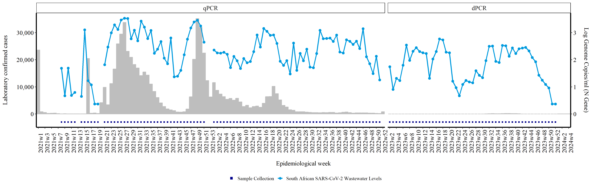
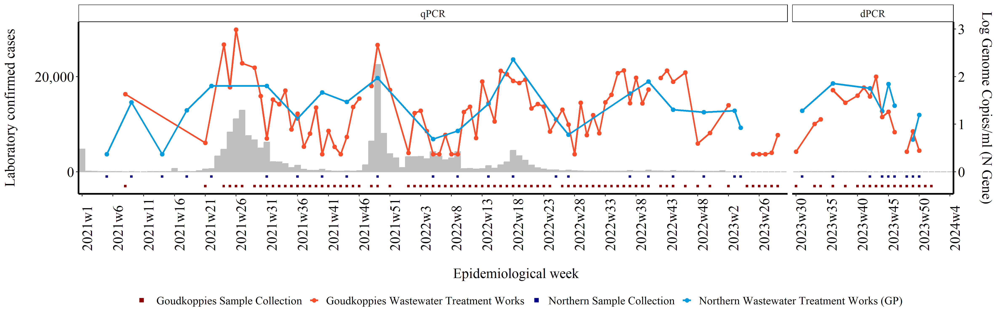

## SARS-CoV-2 Quantitative Levels Analysis

The National Institute for Communicable Diseases (NICD) currently oversees SARS-CoV-2 surveillance through two key methods: 
tracking changes in reported clinical cases documented in the NICD's Notifiable Medical Conditions Reporting's(NMC) register, 
and observing variations in SARS-CoV-2 levels detected by performing a PCR test on wastewater samples. 
These dual metrics, clinical data and wastewater analysis, can be conveniently visualized together in a unified graph. 
This guide offers detailed instructions on performing such analysis and visualization.

The graphs are produced using R version 4.2.2 or higher and the following packages are required to run the script:
 
	library (ggplot2)
	library(ggthemes)
	library(scales)
	library(tidyverse)
	library(readxl)
	library(dplyr)
	library(lubridate)
	library(rlang)
	library(writexl)

#Preparing clinical case data 

Access to clinical data is restricted, and permissions must be obtained from the NMC.
Once Access is obtained, clinical case data is downloaded from the NMC linelist. The data is exported as excel files. 
Due to the large volume of cases in some years, there may be multiple excel files produced, as excel has a limit in the number of
rows that per file. The first step would be import all the files into R dataframes: 

	cov211<- read_xlsx("/path/to/file/SARS//covid_21_1.xlsx")
	cov212<- read_xlsx("/path/to/file/SARS//covid_21_2.xlsx")
	cov213<- read_xlsx("/path/to/file/SARS//covid_21_3.xlsx")
	cov214<- read_xlsx("/path/to/file/SARS//covid_21_4.xlsx")
	cov215<- read_xlsx("/path/to/file/SARS//covid_21_5.xlsx")
	cov216<- read_xlsx("/path/to/file/SARS//covid_21_6.xlsx")
	cov217<- read_xlsx("/path/to/file/SARS//covid_21_7.xlsx")
	cov218<- read_xlsx("/path/to/file/SARS//covid_21_8.xlsx")
	cov219<- read_xlsx("/path/to/file/SARS//covid_21_9.xlsx")
	cov2110<- read_xlsx("/path/to/file/SARS//covid_21_10.xlsx")
	cov2111<- read_xlsx("/path/to/file/SARS//covid_21_11.xlsx")
	cov221<- read_xlsx("/path/to/file/SARS//covid_22_1.xlsx")
	cov222<- read_xlsx("/path/to/file/SARS//covid_22_2.xlsx")
	cov223<- read_xlsx("/path/to/file/SARS/covid_22_3.xlsx")
	cov23<- read_xlsx("/path/to/file/SARS/covid_23.xlsx")
	cov24<- read_xlsx("/path/to/file/SARS/covid_24.xlsx")

Now that we have multiple dataframes created, we want to create one dataframe to work with. To do this we are going to 
bind each of the dataframes into one "covcases" dataframe using the bind_rows command. Bind rows allows you to merge dataframe that have 
the same column names in such a way that all the rows in one dataframe are added below the rows of another. 

	covcases <- bind_rows(cov211, cov212, cov213, cov214, cov215, cov216, cov217, cov218, cov219, 
                      cov2110, cov2111, cov221, cov222,cov223, cov23, cov24)

At this point, you may want to have a look at the clinical cases in the dataframe (df) in which case you can view them using: 
	View(cases)

If you're unsure of all the disctricts included in the df, you can create a table to count all the unique districts 

	table(covcases$District)

As there are many districts across the country, we only want to filter for districts in which we collect
wastewater samples. To do this we'll use the filter command from the tidyverse library. 

	covcases <- covcases %>%
	filter(District == "GP CITY OF JOHANNESBURG METRO" | District == "City of Johannesburg Metro" |
           District == "FS MANGAUNG METRO" | District == "Mangaung Metro" |
           District == "EC NELSON MANDELA BAY METRO" | District == "eThekwini Metro" |
           District == "GP CITY OF TSHWANE METRO" | District == "City of Tshwane Metro" |
           District == "GP EKURHULENI METRO" | District == "Ekurhuleni Metro" |
           District == "KZN ETHEKWINI METRO" | District == "eThekwini Metro" |
           District == "WC CITY OF CAPE TOWN METRO" | District == "City of Cape Town Metro" |
           District == "EC BUFFALO CITY METRO"| District == "Buffalo City Metro" |
           District == "NW BOJANALA PLATINUM"| District == "Bojanala Platinum" |
           District == "NW DR KENNETH KAUNDA"| District ==  "Dr Kenneth Kaunda" )

For most surveillance reports produced by the NICD, results are reported according to epidemiological weeks (epiweeks). 
For this report we will also be using epiweeks to report our findings. In order to convert the sample collection dates to epiweeks, 
we'll use the lubridate library to create a new column with the epiweeks of laboratory confirmed SARS-CoV-2 cases: 

	covcases <- covcases %>% 
	filter(Diagnosis_Method == "Laboratory confirmed")
	covcases$newcoldate <- format(as.Date(covcases$Notification_Date, format = "%Y/%m/%d"), "%Y-%m-%d") #changing the format of the date from y/m/d to ymd 
	covcases$epiweek <- lubridate::epiweek(ymd( covcases$newcoldate)) #generate epiweek

In the epiweek column you will find a number representing the epiweek the sample was collected in. For example, if a sample was collected on 2024-04-25,
then the number would be "17". However, we like to report our epiweeks with the year combined (eg 2024w17). This is just a matter of preference, 
and may be modified to suit your preferences. In order to add the year onto the epiweek with a "w" inbetween, we first create a column with the year
the sample was created, and then another column with "w" and concatenate the year, "w" and epiweek column to get our desired format:
 
	covcases$year <- strftime(covcases$newcoldate, "%Y") #Creating year column  
	covcases$week <- "w" #added column with w
	my_cols <- c("year", "week", "epiweek") #new data object with 3 columns combined
	covcases$epiweek2 <- do.call(paste, c(covcases[my_cols],sep ="")) #created new variable using concat columns

	cases1 <- covcases

Since we report findings nationally and at a district level, we want to also create dataframes for each district. We'll do this by filtering for only the 
clinical cases found in that district. As R is case-sensitive, we'll filter for all variations in spelling of the districts found in the linelist. 

	joburg_cases <- cases1 %>%
	filter(District == "GP CITY OF JOHANNESBURG METRO" | District == "City of Johannesburg Metro")

	mangaung_cases <- cases1 %>%
	filter(District == "FS MANGAUNG METRO" | District == "Mangaung Metro")

	nelson_cases <- cases1 %>%
	filter(District == "EC NELSON MANDELA BAY METRO" | District == "eThekwini Metro" )

	tshwane_cases <- cases1 %>%
	filter( District == "GP CITY OF TSHWANE METRO" | District == "City of Tshwane Metro")

	ekurhuleni_cases <- cases1 %>%
	filter(District == "GP EKURHULENI METRO" | District == "Ekurhuleni Metro" )

	ethekwini_cases <- cases1 %>%
	filter(District == "KZN ETHEKWINI METRO" | District == "eThekwini Metro")

	capetown_cases <- cases1 %>%
	filter(District == "WC CITY OF CAPE TOWN METRO" | District == "City of Cape Town Metro" )

	buffalo_cases <- cases1 %>%
	filter(District == "EC BUFFALO CITY METRO"| District == "Buffalo City Metro" )

	bojanala_cases <- cases1 %>%
	filter(District == "NW BOJANALA PLATINUM"| District == "Bojanala Platinum" )

	jb_marks_cases <- cases1 %>%
	filter(District == "NW DR KENNETH KAUNDA"| District ==  "Dr Kenneth Kaunda" )

#Preparing wastewater levels           

There are two ways in which you can import the wastewater data in this R script. The first is by importing a csv file

	water <- read.csv("path/to.file.csv")

Or using an API token from RedCap, which is the data management system used by our team. We usually use the API token as it allows us to 
automatically run this script without having to first download directly from RedCap. 

	token <- "insert your private token here"
	url <- "insert RedCap URL here"
	formData <- list("token"=token,
                 content='record',
                 action='export',
                 format='csv',
                 type='flat',
                 csvDelimiter='',
                 rawOrLabel='label',
                 rawOrLabelHeaders='raw',
                 exportCheckboxLabel='false',
                 exportSurveyFields='false',
                 exportDataAccessGroups='false',
                 returnFormat='json'
	)
	response <- httr::POST(url, body = formData, encode = "form")
	result <- httr::content(response)

	water <- result

We then filter for the wastewater treatment plants (WWTP) that we would like to include in the report: 

	water <- water %>% 
	  filter( site_name == "Northern Wastewater Treatment Works (GP)" |
            site_name == "Northern Wastewater Treatment Works (KZN)"| 
            site_name == "Rooiwal Wastewater Treatment Works"| 
            site_name ==  "ERWAT Vlakplaat Wastewater Treatment Works"|
            site_name ==  "Central Wastewater Treatment Works (KZN)"|
            site_name ==  "Goudkoppies Wastewater Treatment Works"|
            site_name ==  "Hartebeesfontein Waterworks"|
            site_name ==  "Daspoort Wastewater Treatment Works" |
            site_name ==  "Zandvleit Wastewater Treatment Works"|
            site_name == "Borcheds Quarry Wastewater Treatment Works"|
            site_name == "Brickfield Pre-treatment Works" |
            site_name == "Sterkwater Wastewater Treatment Works"|
            site_name == "Bloemspruit Wastewater Treatment Works"|
            site_name ==  "Kwanobuhle Wastewater Treatment Works" |
            site_name == "East Bank Wastewater Treatment Works"| 
            site_name ==  "Mdantsane Wastewater Treatment Works" |
            site_name == "Mmabatho Water Treatment Works" |
            site_name == "Musina WWTW (in town)" |
            site_name == "Kingstonvale"|
            site_name == "Boitekong"| 
            site_name == "Rustenburg Wastewater Treatment Works" |
            site_name == "Nancefield"| 
            site_name == "Komatipoort Sewage plant"|
            site_name == "Mahikeng Water TreatmentWorks")

We then generate an epiweeks column for the wastewater samples based on the sample collection dates. We also set up the columns we need
by simplifying the column names, and creating a column with the log genome copies per ml 

	water1 <- water
	water1 <- water1 %>% arrange(ymd(water1$sam_col_date))
	water1$epiweek <- lubridate::epiweek(ymd(water1$sam_col_date)) #generate epiweek
	water1$year <- strftime(water1$sam_col_date, "%Y") #Creating year column  
	water1$week <- "w" #added column with w
	my_cols <- c("year", "week", "epiweek") #new data object with 3 columns combined
	water1$epiweek2 <- do.call(paste, c(water1[my_cols],sep ="")) #created new variable using concat columns

	water1$levels <- water1$n_gene_ml
	water1$Date <- water1$sam_col_date
	water1$Result <-water1$sars_cov_2_pcr_result
	water1 <- water1 %>%
	  mutate(levels = na_if(levels, levels < 0))
	water1 <- water1 %>%
	  mutate(levels = if_else(levels<2.34, 2.34, levels)) #replace lower than 2.34 with 2.34 (limit of quantification for qPCR)
	water1$loglevels <- log10(water1$levels)

Since wastewater levels were initially tested using a qPCR and later change to dPCR, we add a quality check for the "PCR" column which ensure the correct 
type of PCR is indicated based on when we switched to dPCR (epiweek 30 of 2023) 

	water1 <- water1 %>%
	  mutate(PCR = if_else(year == 2021, "qPCR", PCR)) %>%
	  mutate(PCR = if_else(year == 2022, "qPCR", PCR)) %>%
	  mutate(PCR = if_else(year == 2023 & week < 30, "qPCR", PCR)) %>%
	  mutate(PCR = if_else(year == 2023 & week > 30, "dPCR", PCR)) %>%
	  mutate(PCR = if_else(year == 2024, "dPCR", PCR)) 

#Plotting clinical cases against wastewater levels  

We'll start by plotting the national waterwater levels against the clinical cases. The wasterwater levels will be in the form of a line graph, 
and bars will be used to represent the number of clinical cases.  

We start by tabulating the number of samples received 

	rsa_samples <- cases1 %>%
	  group_by(epiweek2)%>%
	count(epiweek2, na.rm=TRUE)

	rsa_water <- water1 %>% 
	  filter( Site.Name. == "Goudkoppies Wastewater Treatment Works" |
            Site.Name. == "Northern Wastewater Treatment Works"| 
            Site.Name. == "Rooiwal Wastewater Treatment Works" |
            Site.Name. == "Daspoort Wastewater Treatment Works" |
            Site.Name. == "ERWAT Vlakplaat Wastewater Treatment Works" |
            Site.Name. == "Hartebeesfontein Waterworks" |
            Site.Name. == "Zandvleit Wastewater Treatment Works" |
            Site.Name. == "Borcheds Quarry Wastewater Treatment Works" |
            Site.Name. == "East Bank Wastewater Treatment Works " |
            Site.Name. == "Mdantsane Wastewater Treatment Works"|
            Site.Name. == "Brickfield Pre-treatment Works  " |
            Site.Name. == "Kwanobuhle Wastewater Treatment Works"|
            Site.Name. == "Sterkwater Wastewater Treatment Works " |
            Site.Name. == "Bloemspruit Wastewater Treatment Works"| 
            Site.Name. == "Central Wastewater Treatment Works " |
            Site.Name. == "Northern Wastewater Treatment Works"|
            Site.Name. == "Mahikeng Water Treatment Works"|
            Site.Name. == "Mmabatho Water Treatment Work"|
            Site.Name. == "Rustenburg Wastewater Treatment Works")

	rsacopies <- rsa_water %>% 
	  group_by(epiweek2)%>%
	  summarise(sum_genomes = sum(levels,na.rm = TRUE),
            .groups = 'keep')

	rsacopies["sum_genomes"][rsacopies["sum_genomes"] == 0] <- NA 

	rsacases_vs_water<- full_join(rsa_samples, rsa_water, by= "epiweek2")
	rsacases_vs_water<- full_join(rsacases_vs_water, rsacopies, by= "epiweek2")

repeating this just for weeks where there are clinical cases but no wastewater samples otherwise it would be blank

	rsacases_vs_water <- rsacases_vs_water %>%
	  mutate(PCR = if_else(year == 2021, "qPCR", PCR)) %>%
	  mutate(PCR = if_else(year == 2022, "qPCR", PCR)) %>%
	  mutate(PCR = if_else(year == 2023 & week < 30, "qPCR", PCR)) %>%
	  mutate(PCR = if_else(year == 2023 & week > 30, "dPCR", PCR)) %>%
	  mutate(PCR = if_else(year == 2024, "dPCR", PCR)) %>%
	  mutate(PCR = if_else(is.na(PCR), "qPCR", PCR)) 

	rsacases_vs_water$final_result <- rsacases_vs_water$SARS.CoV.2.PCR.result

Since we don't need all the columns currently in the dataframe, select the columns we want, which is a bit easier to work with.
	rsacases_vs_water <- rsacases_vs_water %>%
	  select(epiweek2, n, sum_genomes, Date, PCR)

	rsacases_vs_water$loglevels <- log10(rsacases_vs_water$sum_genomes)

	rsacases_vs_water<- rsacases_vs_water %>%
	  mutate(tested = case_when( (sum_genomes > 0) ~ -0.3)) %>%
	  mutate(n = if_else(is.na(n), 0, n)) #replace na with 0

	rsacases_vs_water$epiweek3 <- rsacases_vs_water$epiweek2

	rsacases_vs_water <- rsacases_vs_water %>%
	  separate(epiweek3, sep = "w", into = c("year", "week")) %>%
	  mutate(across(c("year", "week"), as.integer)) 

	rsacases_vs_water <- rsacases_vs_water %>%
	  filter(year != 2020)

	rsacases_vs_water <-  rsacases_vs_water[ #ordering by year first then week
	  with(rsacases_vs_water, order(year, week)),
	]

	rsacases_vs_water$epiweek2 <- factor(rsacases_vs_water$epiweek2, levels = unique(rsacases_vs_water$epiweek2), ordered = T)

	rsacases_vs_water$Country <- "South African SARS-CoV-2 Wastewater Levels"

	rsacases_vs_water$Date <- "w"

remove duplicated rows 

	rsacases_vs_water <- rsacases_vs_water %>% distinct()

	rsacases_vs_water$end <- lubridate::parse_date_time(paste(rsacases_vs_water$year, rsacases_vs_water$week,0, sep="-"),'Y-W-w') + days(6)
	#lubridate::parse_date_time(year, week, 0= week start on sunday, sep = formwat you want)
	#this gives start of epiweek so add 6 days to get end of epiweek

	every_nth = function(n) {
	  return(function(x) {x[c(TRUE, rep(FALSE, n - 1))]})
	}

	png("/path/to/file/overall_rsa.png", 
    	width = 5*950,
    	height = 5*300, 
    	res = 300,
    	pointsize = 8)
 
	  rsaplot <- ggplot(rsacases_vs_water) +
	  geom_point(aes(x=epiweek2, y=tested * 10000, group = 1, col = "Sample Collection"), stat="identity", size=1, shape = 15)+
	  geom_bar(aes(x=epiweek2, y=n), stat="identity", fill="gray",
           colour="gray")+
	  geom_point(aes(x=epiweek2, y=loglevels *10000, 
                 group=Country, col=Country),stat="identity", size=2)+
	  geom_line(aes(x=epiweek2, y=loglevels *10000,  
                group=Country, col=Country),stat="identity", size=1) +
	  scale_x_discrete(breaks = every_nth(n = 2)) +
	  scale_colour_manual(values = c("Sample Collection" = "darkblue", "South African SARS-CoV-2 Wastewater Levels" = "#009ADE")) +
	  guides(color = guide_legend(override.aes = list(shape = c(15, 16),
                                                  linetype = c(0, 1)) )) + 
	  scale_y_continuous(sec.axis=sec_axis(~ . /10000,name="Log Genome Copies/ml (N Gene)\n"),
                     breaks = scales::pretty_breaks(n = 4),
                     labels = label_comma()) + 
	  labs(x="\nEpidemiological week",y="Laboratory confirmed cases\n")+
	  facet_grid(~factor(PCR, levels=c('qPCR', 'dPCR')), scales = "free_x", space= "free_x")+
	  ggthemes::theme_tufte()+
	  theme(
    axis.text.x = element_text(angle = 90, hjust = 0,color="black", size=12 ),
    axis.text.y = element_text(color="black", size=12 ),
    legend.position="bottom",
    legend.title = element_blank(),
    text = element_text(color="black", size=12),
    axis.line.x = element_line(color="black", size = 1),
    axis.line.y = element_line(color="black", size = 1),
    strip.background = element_rect(fill = "white"), 
    strip.text = element_text(size = 12) )

	rsaplot

	dev.off()

#Creating a district level plot

Below is the continuation and completion of the detailed guide for performing SARS-CoV-2 quantitative levels analysis using R. 
This guide includes plotting the data at a district level. In the example below we have selected Johannesburg as our district of interest. For other districts, replace the District Name and Site Names for 
your district of interest. 

First start by tabulating the number of samples received. We do this by grouping the samples by epidemiological week and then counting the number of samples per week. 

	jhb_samples <- joburg_cases %>%
	  group_by(epiweek2)%>%
	  count(epiweek2, na.rm=TRUE)

Then we filter for samples that were collected in our district of interest and at the wastewater treatment plants of interest. In this case we're filtering for samples 
collected in the Johannesburg Municipality, at the Goudkoppies and Northern Wastewater Treatment Plants.  

	jhb_water <- water1 %>% 
	  filter(District.Name == "Johannesburg MM") %>%
	  filter( Site.Name. == "Goudkoppies Wastewater Treatment Works" |
            Site.Name. == "Northern Wastewater Treatment Works (GP)")

We then merge the two data frames and create a new column for the final PCR results. 

	jhbcases_vs_water<- full_join(jhb_samples, jhb_water, by= "epiweek2")
	jhbcases_vs_water$final_result <- jhbcases_vs_water$SARS.CoV.2.PCR.result

We then select relevant columns we would like to work with, and remove rows that have invalid epiweek values i.e all samples in which epiweek2 = NAwNA as these are 
samples which had no sample collection dates.

	jhbcases_vs_water <- jhbcases_vs_water %>% 
	  select(epiweek2, n, Site.Name., 
         Site.Province., District.Name,Genome.copies.mL...N.gene.., levels, loglevels, Date, final_result, PCR) %>% 
	  filter(epiweek2 != "NAwNA")

In our reports we use square markers to indicate weeks where samples were tested. We place these markers below zero on the x-axis, in line with the corresponding
epiweek. In order to do this we create new columns (tested1 and tested2) for each WWTP. We use the mutate function to create these columns and assign the value -0.3 or -0.1 for each site
if a sample was tested and had a Positive or Negative result. The values -0.3 and -0.1 are arbitrary, and were selected to ensure the marker is graphed below zero.  

	jhbcases_vs_water<- jhbcases_vs_water %>%
	  mutate(tested1 = case_when( (Site.Name. == "Goudkoppies Wastewater Treatment Works" & final_result == "Positive") ~ -0.3, 
                              (Site.Name. == "Goudkoppies Wastewater Treatment Works" & final_result == "Negative") ~ -0.3)) %>%
	  mutate(tested2 = case_when( (Site.Name. == "Northern Wastewater Treatment Works (GP)" & final_result == "Positive") ~ -0.1, 
                              (Site.Name. == "Northern Wastewater Treatment Works (GP)" & final_result == "Negative") ~ -0.1))

Before plotting, we want to ensure that the correct order of the epiweeks such that the order is by year first, then week.  To do this we first create a copy of epiweek2 and name it epiweek3 

	jhbcases_vs_water$epiweek3 <- jhbcases_vs_water$epiweek2

Then we split the epiweek3 column into a "year" column and a "week" column. We then convert the values in these columns into integers. 

	jhbcases_vs_water <- jhbcases_vs_water %>%
	  separate(epiweek3, sep = "w", into = c("year", "week")) %>%
	  mutate(across(c("year", "week"), as.integer)) 

Since we only started testing wastewater samples for SARS-CoV-2 in 2021, we filter out and clinical samples from 2020

	jhbcases_vs_water <- jhbcases_vs_water %>%
	  filter(year != 2020)

Now we can order the samples first by year and then week

	jhbcases_vs_water <-  jhbcases_vs_water[ #ordering by year first then week
	  with(jhbcases_vs_water, order(year, week)),
	]
To ensure this order stays the same when we're plotting the graph, we conver epiweek2 into an ordered factor.

	jhbcases_vs_water$epiweek2 <- factor(jhbcases_vs_water$epiweek2, levels = unique(jhbcases_vs_water$epiweek2), ordered = T)

Initially samples were tested using a qPCR but during 2023, we switched to testing samples using a dPCR. This change is indicated in our graphs using facets which show the type of PCR test performed. To create
these facets, we first specify which type of PCR test was performed based on when the samples were collected. 

	jhbcases_vs_water <- jhbcases_vs_water %>%
	  mutate(PCR = if_else(year == 2021, "qPCR", PCR)) %>% # Set PCR method for 2021 to qPCR
	  mutate(PCR = if_else(year == 2022, "qPCR", PCR)) %>% # Set PCR method for 2022 to qPCR
	  mutate(PCR = if_else(year == 2023 & week < 30, "qPCR", PCR)) %>% # Set PCR method for early 2023 to qPCR
	  mutate(PCR = if_else(year == 2023 & week > 30, "dPCR", PCR)) %>% # Set PCR method for late 2023 to dPCR
	  mutate(PCR = if_else(is.na(PCR), "qPCR", PCR)) %>% # Replace NA PCR values with qPCR
	  mutate(n = if_else(is.na(n), 0, n)) #replace na with 0

This next line of code is only necessary if you have many samples spanning multiple years. You may want to only show every nth epiweek on the graph instead of every week as this may appear cluttered. 
This funtion allows you to return every nth element. When added to the graph, you specify the value of n.

	every_nth = function(n) {
	  return(function(x) {x[c(TRUE, rep(FALSE, n - 1))]})
	}

Then we create the graph and save it as a png file.

	png("/path/yo/file/Johannesburg.png", # Create a PNG file for the plot 
    	width = 5*950,  # Set width of the image
    	height = 5*300, # Set height of the image
    	res = 300, # Set resolution of the image
    	pointsize = 8) # Set point size for the image
  
	jhbplot <- ggplot(jhbcases_vs_water) +    # Create ggplot object with jhbcases_vs_water data frame
	geom_bar(aes(x = epiweek2, y = n), stat = "identity", fill = "gray", colour = "gray") +   # Add bar plot for number of cases
	geom_point(aes(x = epiweek2, y = tested1 * 10000, group = 1, col = "Goudkoppies Sample Collection"), stat = "identity", size = 1, shape = 15) +   # Add points for Goudkoppies sample collection
	geom_point(aes(x = epiweek2, y = tested2 * 10000, group = 1, col = "Northern Sample Collection"), stat = "identity", size = 1, shape = 15) +   # Add points for Northern sample collection
	geom_point(aes(x = epiweek2, y = loglevels * 10000, group = Site.Name., col = Site.Name.), stat = "identity", size = 2) +   # Add points for log genome copies
	geom_line(aes(x = epiweek2, y = loglevels * 10000, group = Site.Name., col = Site.Name.), stat = "identity", size = 1) +   # Add lines for log genome copies
	scale_colour_manual(values = c("Goudkoppies Sample Collection" = "darkred", "Northern Sample Collection" = "darkblue", 
                                "Goudkoppies Wastewater Treatment Works" = "#FC4E2A", "Northern Wastewater Treatment Works (GP)" = "#009ADE")) +   # Set custom colors for the points and lines
	scale_y_continuous(sec.axis = sec_axis(~ . / 10000, name = "Log Genome Copies/ml (N Gene)\n"),   # Create secondary y-axis for log genome copies
                     breaks = scales::pretty_breaks(n = 2),   # Set breaks for the y-axis
                     labels = scales::label_comma()) +   # Format y-axis labels with commas
	guides(color = guide_legend(override.aes = list(shape = c(15, 16, 15, 16),   # Customize legend
                                                  linetype = c(0, 1, 0, 1)))) +   
	scale_x_discrete(breaks = every_nth(n = 5)) +   # Set x-axis breaks to show every 5th label
	facet_grid(~factor(PCR, levels = c('qPCR', 'dPCR')), scales = "free_x", space = "free") +   # Create facets for PCR method with free scales
	labs(x = "\nEpidemiological week", y = "Laboratory confirmed cases\n") +   # Add axis labels
	ggthemes::theme_tufte() +   # Apply Tufte theme
	theme(
    	axis.text.x = element_text(angle = 90, hjust = 0, color = "black", size = 16),   # Customize x-axis text
    	axis.text.y = element_text(color = "black", size = 16),   # Customize y-axis text
    	legend.position = "bottom",   # Place legend at the bottom
    	legend.title = element_blank(),   # Remove legend title
    	text = element_text(color = "black", size = 16),   # Set general text properties
    	axis.line.x = element_line(color = "black", size = 1),   # Customize x-axis line
    	axis.line.y = element_line(color = "black", size = 1),   # Customize y-axis line
    	strip.background = element_rect(fill = "white"),   # Customize facet background
    	strip.text = element_text(size = 12))   # Customize facet text

	jhbplot   # Plot the ggplot object

	dev.off()   # Close the PNG device

